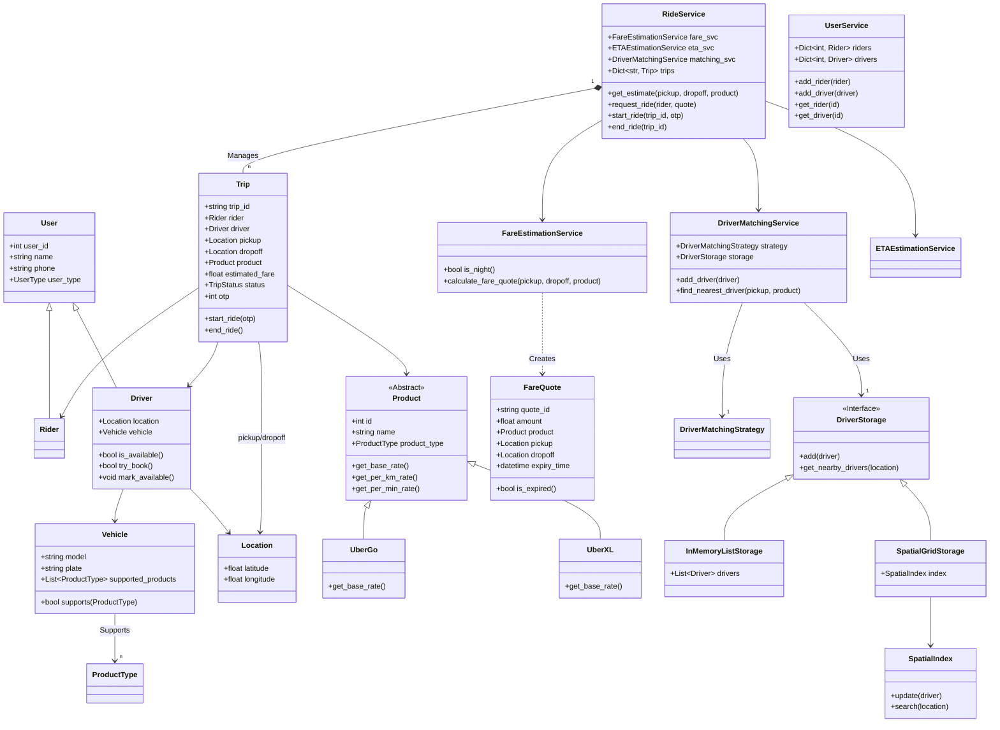

# Uber LLD (Low-Level Design) - Python Implementation

This repository contains a **thread-safe*, **domain-driven**, and **extensible** Low-Level Design (LLD) of a Ride Sharing service like Uber. It simulates real-world scenarios such as concurrent driver booking, fare estimation with TTL (Time-To-Live), and logic for OTP-based ride starting.

## 🏗️ Architecture & Class Diagram

The system is built using a **Rich Domain Model** pattern. `Trip` acts as the central Aggregate Root for a ride lifecycle, managing its own state transitions. Services orchestrate operations around these entities.



## 🔑 Key Features

1.  **Thread-Safe Driver Booking**: Uses `threading.Lock` inside `Driver` to ensure no two riders can book the same driver simultaneously.
2.  **Concurrency Handling**: Relies on Python `RLock` in the `DriverMatchingService` registry to safely add/read drivers during simulation.
3.  **Fare TTL (Time-To-Live)**: Estimates (`FareQuote`) are only valid for a short time (e.g., 5 mins). Expired quotes are rejected, forcing the client to refresh.
4.  **OTP Verification**: Rides only transition to `IN_TRANSIT` when the correct 4-digit OTP is provided (`trip.start_ride(otp)`).
5.  **Dual-Mode Backend Optimization**:
    -   **O(N)**: Simple List Storage.
    -   **O(K)**: **Spatial Grid Indexing** for scalable driver lookup. Toggled via `use_spatial_index=True`.
6.  **Multi-Product Support**: A single vehicle (e.g., SUV) can support multiple product types (e.g., `UberXL` and `UberShare`).

## 🚀 How to Run

The project includes a multi-threaded simulation in `main.py` that mimics concurrent users requests.

1.  **Clone the repo** (or simply ensure you have the files).
2.  **Run the simulation**:
    ```bash
    python3 main.py
    ```

### Sample Output
```text
Rider Rider1 requesting estimate for UberGo...
Rider Rider2 requesting estimate for UberGo...
...
DEBUG: Trip <uuid> assigned to Driver DriverA. OTP: 2154
SUCCESS: Rider Rider1 matched with DriverA. Fare: 120.71
...
Rider Rider1 providing OTP 2154 to driver...
SUCCESS: Trip <uuid> started. Rider Rider1 picked up by DriverA.
...
SUCCESS: Trip <uuid> COMPLETED. Driver DriverA is now available.
```

## 📂 Project Structure

- **`src/`**
  - **`model/`**: `user.py`, `vehicle.py`, `trip.py`, `fare_quote.py`, `location.py`.
  - **`service/`**: `ride_service.py`, `driver_matching_service.py`, `fare_estimation_service.py`.
  - **`repository/`**: `driver_repository.py` (Storage implementations).
  - **`strategy/`**:
    - `matching/`: `driver_matching_strategy.py`.
    - `pricing/`: `pricing_strategy.py`.
  - **`common/`**: `spatial_index.py`.

## 🔮 Future Roadmap: Multi-Stop Trips

To support multiple stops (e.g., A -> B -> C), the following design changes are recommended:

1.  **Refactor `Trip` Entity**:
    -   Replace `pickup` and `dropoff` with `waypoints: List[Location]`.
    -   Add `current_waypoint_index: int` to track progress.

2.  **Update `FareEstimationService`**:
    -   Calculate fare based on the **cumulative distance** of all segments:
        `Total Distance = dist(A, B) + dist(B, C) + ...`

3.  **Update `RideService` Lifecycle**:
    -   Replace `end_ride()` with `complete_stop()`.
    -   If `current_waypoint_index < len(waypoints) - 1`:
        -   Start navigation to next waypoint.
        -   Status remains `IN_TRANSIT`.
    -   Else (Last Stop):
        -   Mark trip as `COMPLETED`.
        -   Make driver available.

## 🚀 Advanced Features Roadmap

To mimic a production-grade system, the following features are planned:

### 1. 📈 Dynamic Surge Pricing
-   **Goal**: Adjust pricing based on real-time Demand/Supply ratio.
-   **Implementation**: Partition map into **Geohash/S2 Cells**.
-   **Logic**: If `Riders in Cell > Drivers in Cell * Threshold`, apply `surge_multiplier` (e.g., 1.5x) to `FareQuote`.

### 2. 📢 Driver Broadcast & Rejection
-   **Goal**: Allow drivers to reject rides.
-   **Implementation**: Instead of instant booking, use a **Ring Broadcast** mechanism.
-   **Logic**: Offer ride to Driver A -> If rejected/timeout -> Offer to Driver B -> Repeat.

### 3. 👯 Ride Pooling (UberShare)
-   **Goal**: Match two independent riders with overlapping routes.
-   **Implementation**: Driver maintains a **Manifest** (Ordered List of Pickups/Dropoffs).
-   **Logic**: Check if `Rider B`'s detour adds < `X` minutes to `Rider A`'s trip.

### 4. 🗺️ Geospatial Indexing (QuadTree)
-   **Goal**: Optimize `find_nearest_driver` from O(N) to O(log N).
-   **Implementation**: Store driver locations in a **QuadTree** or **R-Tree** for efficient KNN (K-Nearest Neighbors) queries.

### 5. ⭐ Ratings & Reputation
-   **Goal**: Match high-rated riders with high-rated drivers.
### 6. 🛡️ Fraud Detection & Safety
-   **Goal**: Detect spoofed GPS locations and prevent collusion.
-   **Implementation**: ML models to analyze location telemetry for anomalies.
-   **Safety**: Real-time "Share Trip" URL generation and unexpected stop detection alerts.

### 7. 🔮 Demand Prediction (ML)
-   **Goal**: Position drivers *before* demand spikes.
-   **Implementation**: Train models on historical data (time, weather, events) to predict heatmaps 15 minutes into the future.

### 8. 🗓️ Advanced Scheduling (Reservations)
-   **Goal**: High-reliability bookings for future slots.
-   **Implementation**: "Reservation Queue" that locks a driver well in advance, ensuring they are online and navigating to pickup.

### 9. 📊 Real-Time Analytics
-   **Goal**: Operational visibility for the platform.
-   **Implementation**: Event streaming (Kafka/Flink) to monitor "Active Trips", "Failed Allocations", and "Average ETA" in real-time.

### 10. 🚲 Multi-Modal Support
-   **Goal**: Combine Ride-Sharing with Public Transport/Scooters.
-   **Implementation**: Update `Product` to support diverse transport modes and enable multi-leg trip routing.


